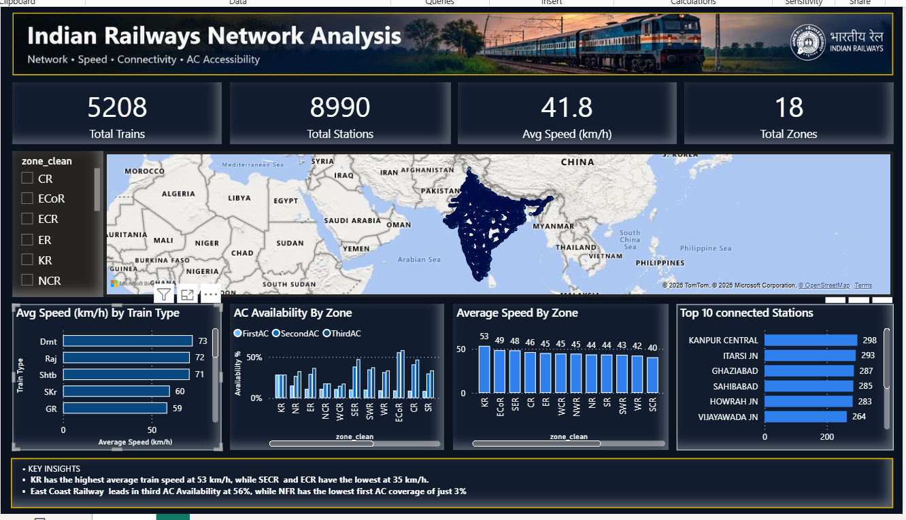

# Indian Railways Network Analysis

🎥 **[Watch 15-sec dashboard demo on LinkedIn](https://www.linkedin.com/posts/pranav-kumbhalwar-937aaa3b1_powerbi-dataanalytics-sql-activity-7506719221779886080--ugO?utm_source=share&utm_medium=member_desktop&rcm=ACoAAGS4OrsBdKwoOTd-H4nvMfoJlhgys7uDSl0)**

## 📊 Overview
An end-to-end data analysis project examining India's railway network, covering 5,208 trains and 8,990 stations across 18 railway zones (17 named zones plus an "Unknown" category for missing data). The analysis benchmarks zone-wise speed performance and AC coach availability to flag zones worth investigating.

## 🎯 Business Problem
Railway zones lack a consolidated view of performance metrics like average speed and AC coach accessibility, making it hard for decision-makers to identify which zones need a closer look.

## 🛠️ Tech Stack
- **MySQL**: relational database design (stations, trains, schedules)
- **Power Query**: data cleaning and transformation
- **DAX**: custom measures for zone-wise calculations
- **Power BI**: interactive dashboard and visualization

## 🔍 Approach
1. Designed a relational schema in MySQL linking stations, trains, and schedules tables
2. Cleaned inconsistent zone data (handled blank and placeholder values as "Unknown")
3. Built DAX measures for average speed and AC-class availability, and cross-verified key KPIs (total trains, stations, zones, average speed) against raw SQL queries
4. Fixed real issues during the build: map geocoding (switched to lat/long), many-to-many cross-filter direction that made AC% identical across zones, and speed measures that ignored minutes
5. Created an interactive Power BI dashboard with zone-level filtering

## 💡 Key Insights
- **KR zone** has the highest average train speed (53 km/h), while **SECR and ECR** are the lowest (35 km/h)
- **ECoR** leads in Third AC availability (56%), while **NFR** has the lowest First AC coverage (just 3%)
- These gaps point to zones worth investigating further. Causes could include terrain, train mix, or infrastructure

## 📌 Dashboard Preview

## 📁 Files
- `queries.sql`: table structure and verification queries
- `measures.txt`: all DAX measures used in the dashboard
- `.pbix`: open in Power BI Desktop for the interactive version

## 👤 Author
Pranav Kumbhalwar | [LinkedIn](https://www.linkedin.com/in/pranav-kumbhalwar-937aaa3b1)
